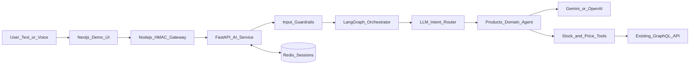

# StoreDesk AI

Natural-language and voice control for an **existing** store-operations stack — without rewriting the UI or GraphQL API.

StoreDesk already has a Next.js frontend and a Node.js GraphQL backend. Product monitoring (stock thresholds, price margins) is implemented as GraphQL mutations the UI already calls. This project shows how to add an AI assist layer on top of that kind of system: those same mutations become **tools** for an agent, and chat/voice becomes another client of the API of record.

> Portfolio/demo focused on practical AI engineering for **brownfield** products: tool calling over existing APIs, LangGraph orchestration, intent routing, guardrails, session memory, and a signed gateway. It implements the products domain (stock and price monitoring), not a full commerce platform.

## The problem this solves

| Without AI | With this AI layer |
| --- | --- |
| User clicks through screens to enable/disable monitoring, pick products, set thresholds | User says *“Turn off quantity monitoring for selected products”* |
| Business logic lives only in the UI + GraphQL resolvers | Same GraphQL mutations; AI selects and validates tool calls |
| New channel = rebuild features | New channel = wrap existing endpoints as tools |

**Principle:** the GraphQL API remains the system of record. The AI service does not invent business logic — it routes, confirms, and executes allowlisted tools that call the same mutations the UI uses.

```text
BEFORE:  User → Next.js UI → GraphQL mutation
AFTER:   User → Chat / Voice → AI tools → same GraphQL mutation
                    ↘ existing UI still works unchanged
```

## Integrating AI into an already-built solution

A realistic path for a deployed Next.js + Node.js GraphQL product:

| Phase | What you do |
| --- | --- |
| 1. Existing system | Frontend and GraphQL API already ship the feature (e.g. stock/price monitoring) |
| 2. Inventory AI-callable actions | List mutations users already perform in the UI |
| 3. Wrap as tools | Each mutation → typed tool schema, validation, and mutation allowlist |
| 4. Add AI service | FastAPI + LangGraph + LLM providers beside the current stack |
| 5. Secure the edge | Node gateway HMAC-signs requests; AI is not a public trust boundary |
| 6. Ground with UI context | Pass selected product IDs, user, tenant, and connector into the agent |
| 7. Guardrails | Confirmation for bulk “all products”, sanitization, rate limits |
| 8. Ship beside the UI | Chat/voice becomes another client of the same GraphQL API |

### Why GraphQL endpoints become tools

- **Controlled surface area** — the model can only call registered tools with validated JSON schemas, not free-form HTTP.
- **Same source of truth** — enable/disable monitoring still goes through the existing mutation.
- **Same auth context** — service key plus user/tenant/connector headers, aligned with server-side UI flows.
- **Easy to extend** — new UI feature → new GraphQL mutation → new tool → agent can call it.

## What this showcases

| Area | Implementation |
| --- | --- |
| Brownfield AI integration | Existing GraphQL mutations exposed as agent tools |
| Agent orchestration | LangGraph workflow for confirmation, routing, domain execution, and response composition |
| Tool calling | Stock and price monitoring tools backed by GraphQL mutations |
| Intent routing | LLM classifier (`all_monitoring` / stock / price) with semantic + rule-based fallback |
| LLM providers | Gemini and OpenAI adapters with provider fallback |
| Voice input | Speech-to-text API with local Vosk/Whisper-compatible implementations |
| Memory | Redis-backed conversation history and pending confirmations (including multi-tool confirms) |
| AI safety | Input sanitization, tool-parameter validation, rate limits, and HMAC service authentication |
| Evaluation | Mock GraphQL scenarios for happy paths, partial failures, errors, and latency |

## AI features

- Turns commands such as “Enable quantity monitoring for selected products with threshold 5” into typed tool calls against existing mutations.
- Uses UI-selected product IDs as grounded context instead of asking the model to invent identifiers.
- Maps unqualified or “all monitoring” requests to both stock and price tools when appropriate.
- Requires confirmation for sensitive bulk (“all products”) actions and restores every planned tool call after “yes”.
- Routes intents to a specialized products agent; falls back to deterministic parsing when the LLM returns text instead of a tool call.
- Keeps multi-turn state and pending actions in Redis.
- Tries configured Gemini and OpenAI providers in sequence when a provider fails.
- Exercises integration behavior through configurable mock GraphQL failure scenarios.

## Architecture



### Request flow

1. The Next.js UI sends text or audio plus selected product context to the Node.js gateway (same product context the click-path UI would use).
2. The gateway rate-limits the caller and signs the exact JSON body using HMAC-SHA256.
3. FastAPI verifies the signature and validates the input before loading Redis session state.
4. LangGraph resolves pending confirmations and routes supported intents to the products agent.
5. The agent asks an LLM for structured tool call(s), with a deterministic fallback for clear commands.
6. Domain tools validate IDs and parameters, then invoke allowlisted GraphQL mutations — the same operations the existing UI already uses.
7. The result and conversation state are returned to the UI.

## Demo capabilities

### Stock monitoring

- Enable or disable quantity monitoring
- Set a quantity threshold
- Apply changes to selected products or all products

### Price monitoring

- Enable or disable price-margin monitoring
- Set a percentage threshold
- Apply changes to selected products or all products

### Example prompts

```text
Enable quantity monitoring for selected products with threshold 5
Turn off quantity monitoring for selected products
Disable all monitoring for all products
Enable price margin monitoring at 8 percent for selected products
Disable monitoring for selected products
```

The demo UI also exposes raw requests/responses and can switch the mock backend between:

- `happy_path`
- `partial_failure`
- `full_failure`
- `slow_response`
- `server_error`
- `auth_failure`

## Technology

- **AI service:** Python, FastAPI, LangGraph, LangChain
- **Models:** Google Gemini and OpenAI
- **Routing:** LLM intent classifier with semantic / rule-based fallback
- **State:** Redis
- **API integration:** GraphQL (tools over existing mutations)
- **Gateway:** Node.js, Express, HMAC-SHA256, rate limiting
- **Demo UI:** Next.js (stand-in for the existing product UI)
- **Local environment:** Docker Compose

## Quick start

### Prerequisites

- Docker with Docker Compose 2.30+
- A Gemini or OpenAI API key

### Run the stack

```bash
git clone https://github.com/fistix/store-desk-ai.git
cd store-desk-ai

cp .env.production.example .env.dev
# Add GEMINI_API_KEY or OPENAI_API_KEY to .env.dev

docker compose up --build
```

`docker-compose.override.yml` is loaded automatically and supplies `.env.dev`,
development build targets, source mounts, and hot reload.

Open:

- Demo UI: <http://localhost:3000/storedesk-test>
- Node gateway health: <http://localhost:4010/health>
- AI service health: <http://localhost:8000/health>

**Tip:** For “selected products” prompts, check one or more products in the UI panel before submitting — those IDs are passed as grounded context to the agent.

Local `.env` files are intentionally ignored. Use the committed example files as templates and never commit API keys.

For production-style Compose commands and service-by-service setup, see [Deployment](docs/DEPLOYMENT.md).

## Project structure

```text
.
├── frontend/                   # Next.js demo UI (stand-in for existing product UI)
├── backend/                    # Node.js gateway, HMAC signing, rate limits
├── storedesk-ai/
│   ├── agent/
│   │   ├── orchestrator.py    # LangGraph control flow
│   │   ├── llm_intent_classifier.py
│   │   ├── semantic_intent_classifier.py
│   │   └── domains/products/
│   │       ├── agent.py       # Products-specific reasoning
│   │       └── tools/         # Stock and price GraphQL tools
│   ├── core/                  # API gateway, auth, Redis, GraphQL, STT
│   ├── providers/             # Gemini and OpenAI adapters
│   └── security/              # Prompt and request safeguards
├── storedesk-mock-server/     # Scenario-driven GraphQL stand-in for the existing API
└── docker-compose.yml
```

## Design decisions

- **AI beside the product, not instead of it:** GraphQL remains the system of record; the agent only selects validated tools.
- **Domain tools over generated API calls:** the model can select only registered tools with validated JSON schemas.
- **Graph workflow over a free-running loop:** LangGraph makes confirmation and routing transitions explicit and bounded.
- **Selected IDs as trusted context:** product identifiers come from the UI and are checked before mutation execution.
- **Multi-tool confirmation:** bulk “all monitoring” actions persist and restore every planned tool call after the user confirms.
- **Deterministic fallback:** clear operational commands still produce a predictable tool call when a provider does not follow tool-calling instructions.
- **Mock GraphQL service:** agent behavior can be demonstrated without access to a real store or customer data.
- **Service boundary authentication:** the public-facing Node gateway signs requests to the isolated AI service.

## Security model

- HMAC-SHA256 authentication with a short timestamp window prevents unsigned service calls and basic replay attacks.
- Per-user rate limiting is applied at the Node gateway (assist + voice) and again in the AI service via a Redis fixed-window counter. Both layers emit `Retry-After` / RateLimit headers on 429.
- Inputs are checked for common injection patterns before routing and again before model use.
- Tools validate selected product IDs and expose only known GraphQL mutations.
- Secrets belong in ignored local environment files or a deployment secret manager.

Regex-based prompt screening is defense in depth, not a complete prompt-injection solution. Authorization and strict tool schemas remain the primary controls.

## Testing

Offline tests cover routing fallbacks, deterministic tool-call construction, confirmation decisions, and prompt-injection rejection:

```bash
cd storedesk-ai
pip install -r requirements.dev.txt
pytest tests -q
```

The mock server provides integration scenarios for partial failures, authentication failures, server errors, and delayed responses.

## Current limitations

- Only the products domain is implemented.
- Supported actions are limited to stock and price monitoring.
- Gemini and OpenAI are the active provider adapters; other provider files are experimental and not loaded.
- The demo uses mock users and products. A production integration must derive identity and permissions from verified JWT claims.
- The security monitor and provider telemetry should use production observability infrastructure before deployment.

## Next steps

- Add orders, suppliers, and customer-message domain agents — each as tools over additional existing GraphQL endpoints.
- Build a repeatable agent evaluation dataset with tool-selection and argument-accuracy metrics.
- Add OpenTelemetry traces across gateway, graph nodes, LLM calls, and GraphQL tools.
- Add CI for unit and container smoke tests.

## License

Demo and learning project. Add an explicit open-source license before accepting external contributions.
